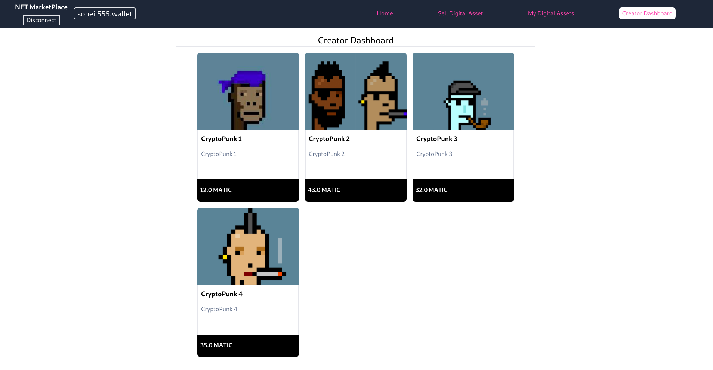

# PNM( Polygon NFT MarketPlace )

NFT MarketPlace runs on **Polygon Mumbai network** with "Login With Unstoppable" as a login option.





### Login with Unstoppable Domain Demo Video

- https://youtu.be/Z8wmz7UQt3o


### Working App

- http://polygon-nft-marketplace-umber.vercel.app/


### Person of Contact

- Discord ID: soheil#1703

- UnstoppableDomain registered account email address: soheilrasekh555@gmail.com


### Tech Stack

- Typescript
- Nextjs
- Reactjs
- Redux
- Tailwindcss
- solidity
- Hardhat
- IPFS
- OpenZeppelin


## Running Locally


1. Clone the project

   ```bash
    git clone https://github.com/soheil555/polygon-NFT-marketplace.git
    cd polygon-NFT-marketplace
    
   ```

2. Installing dependencies and compile contracts

    ```bash
    npm install
    npx hardhat compile
    ```

3.  Run a local hardhat network

   ```bash
   npx hardhat node
   ```

4. Deploy contracts on the local network

   ```bash
   npx hardhat run scripts/deploy.ts --network localhost 
   ```

5. create .env file

   ```bash
   cp .env.example .env
   ```

6. edit .env file and set values for:

   ```bash
   MUMBAI_URL= #not required for local network
   PRIVATE_KEY= #not required for local network
   NEXT_PUBLIC_NFT_CONTRACT_ADDRESS= #from step 4
   NEXT_PUBLIC_NFT_MARKET_CONTRACT_ADDRESS= #from step 4
   
   NEXT_PUBLIC_UAUTH_CLIENT_ID= #get it from https://unstoppabledomains.com/auth
   NEXT_PUBLIC_UAUTH_CLIENT_SECRET= #get it from https://unstoppabledomains.com/auth
   
   NEXT_PUBLIC_UAUTH_REDIRECT_URI=
   NEXT_PUBLIC_INFURA_ID=
   ```

   

7.  Start development server

   ```bash
   npm run dev
   ```


## License

available under the MIT license. See the `LICENSE` file for more info.
# Polygon-NFT
# Polygon-NFT
# Polygon-NFT
